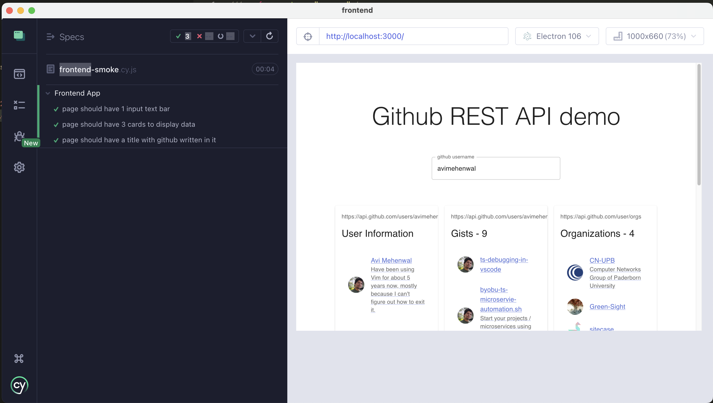

# github-rest-demo

github REST API demo


## How to run the project

### Frotnend

TO run the project localy, we would reqauire a Github PAT, [Follow this guide here on how to create one](https://docs.github.com/en/authentication/keeping-your-account-and-data-secure/creating-a-personal-access-token)

**NOTE:** You would need a Github PAT for be able to see the data in frontend app

1. Create a PAT for your account, make sure `.env.local` file is updated accordingly
2. clone the source onto your machine
3. cd frontend and run the following commands

```
npm install
npm run dev
```

4. access frontend application at `http://localhost:3000/`
5. Run test

```
npm test:e2e
```



### Coding Problem 2

1. cd `problem` directory from root of the project
2. Run the following command

```
npm install
npm start
```

You can change the input array and threshold values at #25 in `problem/index.ts` file and re-run again

3. Run tests

```
npm test
```

#### :v: Get in touch with me

> I am looking for Jobs ... :sunglasses:

- [Github](https://github.com/avimehenwal/)
- [My Website](https://avimehenwal.in)
- [My Blog v2](https://avimehenwal2.netlify.app/)
- [Twitter Handle](https://twitter.com/avimehenwal)
- [LinkedIn](https://in.linkedin.com/in/avimehenwal)
- [Stackoverflow](https://stackoverflow.com/users/1915935/avi-mehenwal)

<a href="https://www.buymeacoffee.com/F1j07cV" target="_blank"></a>

Spread Love :hearts: and not :no_entry_sign: hatred [](https://twitter.com/avimehenwal)